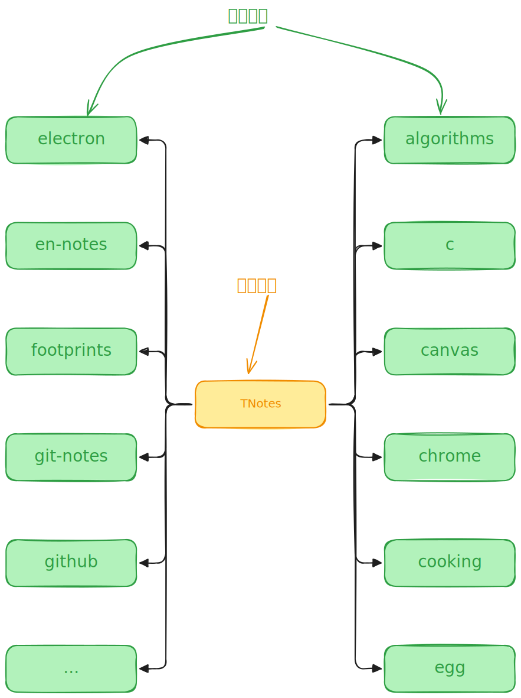

# [0001. TNotes 简介](https://github.com/tnotesjs/TNotes.introduction/tree/main/notes/0001.%20TNotes%20%E7%AE%80%E4%BB%8B)

<!-- region:toc -->

- [1. 🎯 本节内容](#1--本节内容)
- [2. 🫧 评价](#2--评价)
- [3. 🤔 TNotes 是什么？](#3--tnotes-是什么)
- [4. 🤔 TNotes 中的「知识库」、「笔记」指的是什么？](#4--tnotes-中的知识库笔记指的是什么)
- [5. 🤔「知识库」基本结构是？](#5-知识库基本结构是)
- [6. 🤔 TNotes 有什么用？](#6--tnotes-有什么用)
  - [6.1. 通过脚本来自动管理笔记](#61-通过脚本来自动管理笔记)
  - [6.2. 自定义组件，扩展 markdown 功能](#62-自定义组件扩展-markdown-功能)
  - [6.3. 自定义布局](#63-自定义布局)
  - [6.4. 评论功能](#64-评论功能)
- [7. 🤔 TNotes 中「知识库」的类型及其之间的关系是？](#7--tnotes-中知识库的类型及其之间的关系是)
- [8. 🤔 如何搜到 TNotes？](#8--如何搜到-tnotes)
- [9. 🤔 TNotes 的 logo 是？](#9--tnotes-的-logo-是)
- [10. 🔗 引用](#10--引用)

<!-- endregion:toc -->

## 1. 🎯 本节内容

- TNotes 简介

## 2. 🫧 评价

对 TNotes 做一个简单的介绍。

<N :ids="['0028', '0014', '0002']" />

## 3. 🤔 TNotes 是什么？

<a href="https://tnotesjs.github.io/TNotes" target="_blank">
  
</a>

[TNotes](https://tnotesjs.github.io/notes)（Tdahuyou の Notes） 是一个基于开源项目和免费工具（比如：[vitepress][1]、[github pages][2]、[giscus][3]、[markdown-it][4] ……）实现的一个用于快速搭建个人在线开源知识库的免费工具。

但凡是在 TNotes 中能看到的内容，均已开源在 [tnotesjs github][5] 上，有需要的可自行 clone。

TNotes 诞生时间是 -> `24.08.28`，是目前记录笔记所用的主要工具，在使用过程中会根据痛点不断完善。

## 4. 🤔 TNotes 中的「知识库」、「笔记」指的是什么？

- 「知识库」本质上就是一个简单的 git 仓库。
- 「笔记」是在知识库的 notes 目录下存放着一系列从 `0001-9999` 为编号的目录。

## 5. 🤔「知识库」基本结构是？

- 这里以当前 `TNotes.introduction` 这个知识库为例，对其中的核心文件、目录做一个简单介绍：

```bash
# .
# ├── .vscode
# │   ├── settings.json # 存放 VSCode 的配置文件
# ├── index.md # vitepress 主页
# ├── MERGED_README.md
# ├── notes # 存放笔记的目录
# │   ├── 0001. TNotes 简介
# │   ├── 0002. TNotes 公式支持
# │   ├── 0003. 评论功能的技术实现
# │   └── ……
# ├── package.json # 记录项目依赖，封装一些 tnotes scripts 命令
# ├── README.md # 知识库目录源数据，有指定的书写格式要求，TNotes 会自动解析这里边儿的节点来生成目录
# └── sidebar.json # vitepress 中的侧边栏目录的配置文件，由 TNotes 解析根目录下的 README.md 自动生成
```

## 6. 🤔 TNotes 有什么用？

### 6.1. 通过脚本来自动管理笔记

- 解析根目录下的 `README.md` 中的内容，生成整个知识库的目录及首页的目录视图
- 解析笔记配置 `.tnotes.json`，管理笔记的状态
- ……

### 6.2. 自定义组件，扩展 markdown 功能

- `swiper` 图片分页组件
- `markmap` 思维导图组件
- ……

### 6.3. 自定义布局

- 侧边栏折叠功能
- 全屏显示功能
- 解析笔记路径，实现快速使用 VSCode 打开对应笔记的功能
- ……

### 6.4. 评论功能

利用 Giscus 集成了评论功能。

## 7. 🤔 TNotes 中「知识库」的类型及其之间的关系是？

目前在 TNotes 中只有两种类型的知识库：「根知识库」和「子知识库」。

- 根知识库：只有一个，汇总所有子知识库的目录信息，充当了所有知识库的统一访问入口的角色，提供笔记的快速导航功能
- 子知识库：可以有多个，每个子知识库支持独立访问，不依赖于根知识库存在



## 8. 🤔 如何搜到 TNotes？

当前 TNotes 的地址：https://tnotesjs.github.io/TNotes/

已尝试对 `Google Chrome` 和 `Microsoft Bing` 的搜索做了 `SEO` 优化，你可以通过关键字 `github` ➕ `tnotesjs` 快速搜到该站点。

::: swiper


:::

## 9. 🤔 TNotes 的 logo 是？


这是大二 `👣 7291 | 2019-06-14 16:52` 去学校附近的海边拍的脚印，是第一条朋友圈发的图，也是朋友圈的封面，就暂且拿它来做 TNotes 的 logo 吧！

你可以在 TNotes.footprints 中记录的我的 2019 年的动态中看到那条朋友圈。

## 10. 🔗 引用

- [TNotes 首页 - github pages][6]
- [vitepress - github][1]
- [github pages - doc][2]
- [giscus - doc][3]
- [markdown-it - github][4]
- [tnotesjs - github][5]

[1]: https://github.com/vuejs/vitepress
[2]: https://pages.github.com/
[3]: https://giscus.app/zh-CN
[4]: https://github.com/markdown-it/markdown-it
[5]: https://github.com/orgs/tnotesjs/repositories
[6]: https://tnotesjs.github.io/TNotes/
