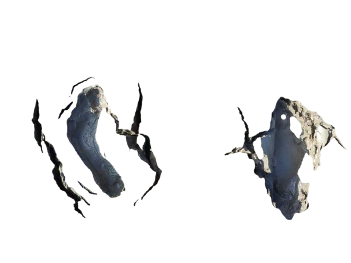
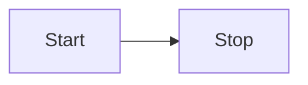

# [0006. TNotes 组件](https://github.com/tnotesjs/TNotes.introduction/tree/main/notes/0006.%20TNotes%20%E7%BB%84%E4%BB%B6)

<!-- region:toc -->

- [1. 🎯 本节内容](#1--本节内容)
- [2. 🫧 评价](#2--评价)
- [3. ⚙️ BilibiliOutsidePlayer - 嵌入 B 站视频](#3-️-bilibilioutsideplayer---嵌入-b-站视频)
- [4. ⚙️ Discussions - 评论模块](#4-️-discussions---评论模块)
- [5. ⚙️ EnWordList - 英文单词列表](#5-️-enwordlist---英文单词列表)
- [6. ⚙️ Footprints - 记录足迹](#6-️-footprints---记录足迹)
- [7. ⚙️ Mermaid - 图表](#7-️-mermaid---图表)
- [8. ⚙️ Swiper - 图片分页](#8-️-swiper---图片分页)

<!-- endregion:toc -->

## 1. 🎯 本节内容

- TNotes 核心组件的使用说明

## 2. 🫧 评价

- 笔记中介绍的这些组件是 TNotes 中封装的一系列 `.vue` 模块；
- 这篇笔记只记录这些组件如何使用，具体实现可以到 `.vitepress/components/*` 中查看相关模块源码；

## 3. ⚙️ BilibiliOutsidePlayer - 嵌入 B 站视频

- 找到需要插入的视频
  - 
- 获取需要插入视频的 BVID -> `BV1QR4y1y7GG`

```md
<BilibiliOutsidePlayer id="BV1QR4y1y7GG" />
<!-- 或者简写 -->
<B id="BV1QR4y1y7GG" />
```

- 最终渲染效果如下：

---

<BilibiliOutsidePlayer id="BV1QR4y1y7GG" />

## 4. ⚙️ Discussions - 评论模块

- 开启和关闭可以通过笔记配置文件 `.tnotes.json` 中的 `enableDiscussions` 字段来控制。
- 评论模块组件会自动插入到文档的结尾。

## 5. ⚙️ EnWordList - 英文单词列表

- 核心功能如下：
  - 词汇预加载
    - 优化单词卡片的加载体验
  - 词汇卡片
    - 支持 pin 到页面上
      - 单词卡片支持拖动
      - 单词卡片尺寸支持调节
      - 层级自动会调节（被点击的 card 默认置顶）
    - 打开自动显示单词卡片的开关之后，当鼠标放在单词卡片上时，会自动展示该单词的详细信息。
  - 发音
    - 支持英音、美音
    - 支持批量播放
      - 被朗读的单词会默认高亮
      - 在批量播放过程中，再次播放任意单词，将会中止后续的播放流程。
  - 完成状态切换
    - 对于记住的词汇，可以在前边儿打勾，学习记录会缓存在浏览器中。
  - 排序
    - 可以配置是否根据字母升序排序

---

::: swiper


:::

- `1` - 右键菜单项
- `2` - 播放到的词汇自动高亮
- `3` - 自动展示单词卡片
- `4` - 单词卡片的 pin 功能

---

- 使用示例：

```md
<!-- 布尔属性：needSort，可以开启按照字母升序排序的功能 -->

<EnWordList :words="[
'cancel',
'explosive',
'numerous',
'govern',
'analyse',
'discourage',
'resemble',
'remote',
'salary',
'pollution',
'pretend',
'kettle',
'wreck',
'drunk',
'calculate',
'persistent',
'sake',
'conceal',
'audience',
'meanwhile',]" />
```

- 最终效果如下：

---

<EnWordList :words="[
'cancel',
'explosive',
'numerous',
'govern',
'analyse',
'discourage',
'resemble',
'remote',
'salary',
'pollution',
'pretend',
'kettle',
'wreck',
'drunk',
'calculate',
'persistent',
'sake',
'conceal',
'audience',
'meanwhile',]" />

## 6. ⚙️ Footprints - 记录足迹

- 参照微信朋友圈的布局，自定义的一个用于记录个人动态的组件。
- 参数传递还有待优化。
- 格式：

```md
🗓 3-15

<Footprints :times="[2025, 3, 15, 0, 43]">
  <template #text-area>
    <p>正在整理 TNotes.template 的功能文档</p>
    <p>现在外边正下着小于雨 🌧️</p>
    <p>不早了</p>
    <p>写完这篇笔记就去睡觉了～</p>
    <p>头发要紧</p>
  </template>
  <template #image-list="{ openModal }">
    
    
    
    
    
  </template>
</Footprints>
```

- 最终渲染效果如下：

---

🗓 3-15

<Footprints :times="[2025, 3, 15, 0, 43]">
  <template #text-area>
    <p>正在整理 TNotes.template 的功能文档</p>
    <p>现在外边正下着小于雨 🌧️</p>
    <p>不早了</p>
    <p>写完这篇笔记就去睡觉了～</p>
    <p>头发要紧</p>
  </template>
  <template #image-list="{ openModal }">
    
    
    
    
    
  </template>
</Footprints>

## 7. ⚙️ Mermaid - 图表

- 输入：

````md

````

- 输出：


## 8. ⚙️ Swiper - 图片分页

- 这是一个极其常用的组件，为了方便调用，已将该组件集成到了 vitepress 的 markdown 扩展中。
- 使用示例：

```md
::: swiper


:::
```

- 最终效果如下：

---

::: swiper


:::
