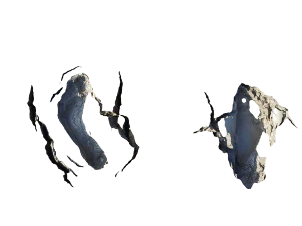

# [0010. 足迹纪录](https://github.com/tnotesjs/TNotes.introduction/tree/main/notes/0010.%20%E8%B6%B3%E8%BF%B9%E7%BA%AA%E5%BD%95)

<!-- region:toc -->

- [1. 🎯 本节内容](#1--本节内容)
- [2. 🫧 评价](#2--评价)
- [3. 🤔 足迹纪录组件如何使用？](#3--足迹纪录组件如何使用)

<!-- endregion:toc -->

## 1. 🎯 本节内容

- Footprints 组件的基本使用

## 2. 🫧 评价

Footprints 组件是参考微信朋友圈的布局写的一个组件，基本就是个人在用。

由于微信 pyq 基本已经不再使用了（后续不确定啥时候才会再启用），目前（25.11）也已经关闭了有一两年了，因此做了这个组件，将所有个人朋友圈的动态搬运到了 TNotes.footprints 中。

::: tip ⏰ TODO

调用形式还有待优化！

:::

## 3. 🤔 足迹纪录组件如何使用？

参照微信朋友圈的布局，自定义的一个用于记录个人动态的组件。

基本使用：

```md
🗓 3-15

<Footprints :times="[2025, 3, 15, 0, 43]">
  <template #text-area>
    <p>正在整理 TNotes.template 的功能文档</p>
    <p>现在外边正下着小于雨 🌧️</p>
    <p>不早了</p>
    <p>写完这篇笔记就去睡觉了～</p>
    <p>头发要紧</p>
  </template>
  <template #image-list="{ openModal }">
    
    
    
    
    
  </template>
</Footprints>
```

最终渲染效果如下：

🗓 3-15

<Footprints :times="[2025, 3, 15, 0, 43]">
  <template #text-area>
    <p>正在整理 TNotes.template 的功能文档</p>
    <p>现在外边正下着小于雨 🌧️</p>
    <p>不早了</p>
    <p>写完这篇笔记就去睡觉了～</p>
    <p>头发要紧</p>
  </template>
  <template #image-list="{ openModal }">
    
    
    
    
    
  </template>
</Footprints>
