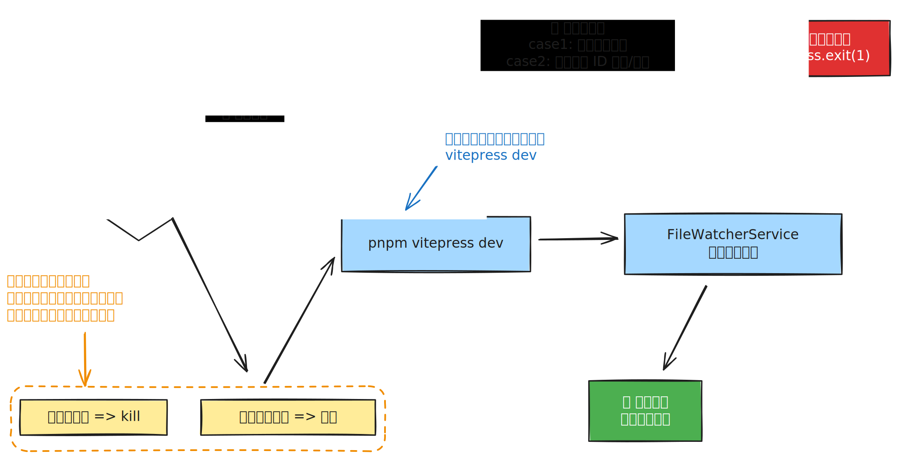

# [0018. dev](https://github.com/tnotesjs/TNotes.introduction/tree/main/notes/0018.%20dev)

<!-- region:toc -->

- [1. 🎯 本节内容](#1--本节内容)
- [2. 🫧 评价](#2--评价)
- [3. 🤔 服务的启动流程是？](#3--服务的启动流程是)
  - [3.1. 执行启动命令](#31-执行启动命令)
  - [3.2. 启动 vitepress 服务](#32-启动-vitepress-服务)
    - [启动预查1：单例服务](#启动预查1单例服务)
    - [启动预查2：检查冲突的笔记索引](#启动预查2检查冲突的笔记索引)
    - [输出启动状态](#输出启动状态)
  - [3.3. 启动缓存与监听服务](#33-启动缓存与监听服务)
    - [步骤 1：扫描笔记目录](#步骤-1扫描笔记目录)
    - [步骤 2：初始化笔记索引缓存](#步骤-2初始化笔记索引缓存)
    - [步骤 3：启动文件监听服务](#步骤-3启动文件监听服务)

<!-- endregion:toc -->

## 1. 🎯 本节内容

- `tn:dev` 命令简介

## 2. 🫧 评价

这篇笔记用于记录 `tn:dev` 命令启动知识库开发服务的核心流程。

## 3. 🤔 服务的启动流程是？



### 3.1. 执行启动命令

```bash
# 执行以下命令，启动笔记服务
pnpm tn:dev

# 相当于执行：
# tsx ./.vitepress/tnotes/index.ts --dev
# 本质是运行 ./.vitepress/tnotes/index.ts 文件，并传入启动参数 --dev
```

### 3.2. 启动 vitepress 服务

在 `.vitepress/tnotes/commands/dev/DevCommand.ts` 中引入了二次封装的 `VitepressService` 类，通过 `vitepressService.startServer()` 来启动 vitepress 服务。

#### 启动预查1：单例服务

需要确保服务是单例的，在服务启动之前会做以下处理：

- 根据服务 ID `${repoName}-vitepress-dev` 检查当前知识库的 vitepress 服务是否已启动过，若检测到服务已经启动则 kill 旧的服务进程。
- 检查服务端口是否被占用，若被占用则终止占用端口的进程。

经过上述处理之后，再执行 `vitepress dev` 命令：

```ts
// 启动 VitePress 开发服务器
const pm = this.configManager.get('packageManager') || DEFAULT_PACKAGE_MANAGER
const args = ['vitepress', 'dev', '--port', port.toString()]

const processInfo = this.processManager.spawn(processId, pm, args, {
  cwd: ROOT_DIR_PATH,
  stdio: ['inherit', 'pipe', 'pipe'],
})
```

#### 启动预查2：检查冲突的笔记索引

通过 `noteManager.countNotes()` 预扫描笔记数量，并在启动 VitePress 之前检测冲突。

```ts
// .vitepress/tnotes/services/VitepressService.ts

const noteCountResult = this.noteManager.countNotes()

if (noteCountResult.conflicts.length > 0) {
  logger.error('⚠️  检测到重复的笔记编号，服务启动已终止！')
  for (const { index, dirNames } of noteCountResult.conflicts) {
    logger.error(`   编号 ${index} 被以下笔记重复使用：`)
    dirNames.forEach((dirName) => {
      logger.error(`      - ${dirName}`)
    })
  }
  logger.error(
    '\n请检查并删除/重命名重复的笔记文件夹，确保每个笔记编号唯一！\n',
  )
  process.exit(1)
}

// .vitepress/tnotes/core/NoteManager.ts

/**
 * 统计笔记数量（仅按目录名规则筛选，不读取文件）
 * @returns 包含去重前数量、去重后数量、冲突笔记列表的统计结果
 */
countNotes(): NoteCountResult {
  if (!existsSync(NOTES_PATH)) {
    return { total: 0, unique: 0, conflicts: [] }
  }

  const entries = readdirSync(NOTES_PATH, { withFileTypes: true })

  // 筛选出符合 "XXXX. 笔记标题" 格式的目录
  const noteDirs = entries.filter(
    (entry) =>
      entry.isDirectory() &&
      !entry.name.startsWith('.') &&
      /^\d{4}\./.test(entry.name),
  )

  const total = noteDirs.length

  // 按 4 位数字编号分组，检测重复
  const indexMap = new Map<string, string[]>()
  for (const entry of noteDirs) {
    const index = entry.name.slice(0, 4)
    if (!indexMap.has(index)) indexMap.set(index, [])
    indexMap.get(index)!.push(entry.name)
  }

  const unique = indexMap.size
  const conflicts: NoteCountResult['conflicts'] = []
  for (const [index, dirNames] of indexMap.entries()) {
    if (dirNames.length > 1) {
      conflicts.push({ index, dirNames })
    }
  }

  return { total, unique, conflicts }
}
```

冲突示例：

```bash
pnpm tn:dev

# > @ tn:dev C:\tnotesjs\TNotes.introduction
# >                          tsx ./.vitepress/tnotes/index.ts --dev

# 🚀 [13:08:28.377] [dev] 启动知识库开发服务
# ❌ [13:08:28.590] ⚠️  检测到重复的笔记编号，服务启动已终止！
# ❌ [13:08:28.590]    编号 0001 被以下笔记重复使用：
# ❌ [13:08:28.590]       - 0001. new
# ❌ [13:08:28.590]       - 0001. TNotes 简介
# ❌ [13:08:28.591]
# 请检查并删除/重命名重复的笔记文件夹，确保每个笔记编号唯一！

#  ELIFECYCLE  Command failed with exit code 1.
```

#### 输出启动状态

打印服务的启动状态（比如扫描到多少篇笔记，一共耗时多长时间），在监听到 vitepress 服务启动完成（监听到进程输出 `Local:` 或者 `http://localhost`）之后，打印启动成功后的一些提示信息。

```bash
pnpm tn:dev

# > @ tn:dev C:\tnotesjs\TNotes.introduction
# >                          tsx ./.vitepress/tnotes/index.ts --dev

# 🚀 [13:20:32.156] [dev] 启动知识库开发服务
# ✅ 服务已就绪 - 共 30 篇笔记，启动耗时 3.7s

#   ➜  Local:   http://localhost:9379/TNotes.introduction/
#   ➜  Network: use --host to expose
#   ➜  press h to show help
```

看到终端打印 `http://localhost:9379/TNotes.introduction/` 之后，意味着 vitepress 服务已经启动成功，此时就可以通过浏览器打开此链接访问开发环境下的知识库了。

::: tip 备注：服务启动进度问题

启动进度的真实百分比不好获取，通过 vitepress 的钩子做了尝试没能成功，可能需要改 vitepress 源码，目前（26.02）所有 TNotes 知识库的启动耗时大致在十几秒以内，是否能够看到真实进度对体验的影响也不是很大，因此暂时先将这个真实百分比的优化点挂起！

测试了 `3k~4k` 笔记数量的知识库 `TNotes.leetcode`，启动耗时大致在 `10s~20s` 左右，因此暂时将启动的超时时间设置为了 `60s`。

:::

### 3.3. 启动缓存与监听服务

在 VitePress 服务启动成功之后，`DevCommand` 会调用 `serviceManager.initialize()` 来初始化缓存和文件监听服务。`ServiceManager` 是一个单例，内部依次完成以下三个步骤：

#### 步骤 1：扫描笔记目录

调用 `noteManager.scanNotes({ skipDuplicateCheck: true })` 全量扫描 `notes/` 目录。与 `countNotes()` 只读取目录名不同，`scanNotes()` 会深入读取每篇笔记的 `.tnotes.json` 配置文件并进行校验修复。

这里传入 `skipDuplicateCheck: true` 跳过重复编号检测，因为在上一阶段（3.2）的 `countNotes()` 中已经完成了冲突检测，避免重复工作。

#### 步骤 2：初始化笔记索引缓存

将扫描结果注入 `NoteIndexCache` 单例，构建两个内存索引：

- `byNoteIndex`：笔记编号（如 `"0001"`）→ 笔记索引项
- `byConfigId`：配置文件中的 UUID → 笔记编号

有了这两个索引，后续通过笔记编号或配置 ID 查询笔记信息时，直接从内存读取，无需再扫描文件系统。

#### 步骤 3：启动文件监听服务

启动 `FileWatcherService`，监听 `notes/` 目录下的文件变化。监听到变化后，会根据事件类型（笔记目录重命名/删除、配置文件变更、README 变更等）自动触发对应的更新逻辑，并同步更新 `NoteIndexCache` 中的缓存数据。

```ts
// .vitepress/tnotes/services/manager.ts

async initialize(): Promise<void> {
  if (this.initialized) {
    logger.warn('ServiceManager 已经初始化')
    return
  }

  try {
    // 1. 扫描所有笔记（跳过重复检测，dev 流程已在 countNotes 中完成）
    logger.info('扫描笔记目录...')
    const notes = this.noteManager.scanNotes({ skipDuplicateCheck: true })
    logger.info(`扫描到 ${notes.length} 篇笔记`)

    // 2. 初始化笔记索引缓存
    logger.info('初始化笔记索引缓存...')
    this.noteIndexCache.initialize(notes)

    // 3. 启动文件监听服务
    this.fileWatcherService.start()

    this.initialized = true
  } catch (error) {
    logger.error('ServiceManager 初始化失败:', error)
    throw error
  }
}
```

对应终端输出：

```bash
# ✅ [13:20:36.227] [dev] 笔记服务已启动 - PID: 664708
# ℹ️  [13:20:36.227] 扫描笔记目录...
# ℹ️  [13:20:36.234] 扫描到 30 篇笔记
# ℹ️  [13:20:36.235] 初始化笔记索引缓存...
# ℹ️  [13:20:36.235] 笔记索引初始化完成，共 30 篇笔记
# ✅ [13:20:36.250] 文件监听服务已启动
# ✅ [13:20:36.251] 监听目录 - C:\tnotesjs\TNotes.introduction\notes
# ✨ [13:20:36.255] [dev] 命令执行耗时：4099 ms
```

至此，`tn:dev` 的整个启动流程完成。服务进入就绪状态，用户可以正常访问知识库并进行编辑，文件变更会被自动监听和处理。
