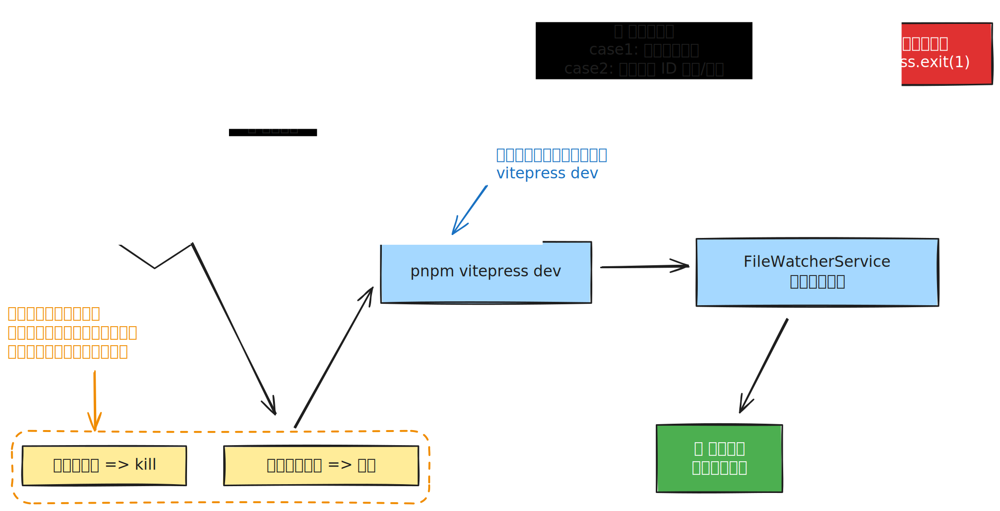

# [0018. dev](https://github.com/tnotesjs/TNotes.introduction/tree/main/notes/0018.%20dev)

<!-- region:toc -->

- [1. 🎯 本节内容](#1--本节内容)
- [2. 🫧 评价](#2--评价)
- [3. 🤔 TNotes 知识库的开发环境启动命令是？](#3--tnotes-知识库的开发环境启动命令是)
- [4. 🤔 服务的启动流程是？](#4--服务的启动流程是)
- [5. 🤔 在扫描笔记目录阶段，都做了哪些处理？](#5--在扫描笔记目录阶段都做了哪些处理)
  - [5.1. NoteInfo 的数据结构](#51-noteinfo-的数据结构)
  - [5.2. `validateNotes` 的具体实现](#52-validatenotes-的具体实现)
- [6. 🤔 初始化笔记索引缓存都存了什么信息？具体作用是？](#6--初始化笔记索引缓存都存了什么信息具体作用是)
- [7. 🤔 为何需要确保服务是单例？](#7--为何需要确保服务是单例)
- [8. 🤔 如何实现单例服务？](#8--如何实现单例服务)
- [9. 🤔 为何不输出 vitepress 服务启动的真实进度百分比，而是展示一个启动计时器？](#9--为何不输出-vitepress-服务启动的真实进度百分比而是展示一个启动计时器)
- [10. 🤔 vitepress 服务启动的超时时间是？](#10--vitepress-服务启动的超时时间是)

<!-- endregion:toc -->

## 1. 🎯 本节内容

- `tn:dev` 命令简介

## 2. 🫧 评价

这篇笔记用于记录 `tn:dev` 命令启动知识库开发服务的核心流程，主要可分为两个阶段：

1. 启动 vitepress 服务
2. 启动 TNotes 笔记监听服务

## 3. 🤔 TNotes 知识库的开发环境启动命令是？

```bash
# 执行以下命令，启动笔记服务
pnpm tn:dev

# 相当于执行：
# tsx ./.vitepress/tnotes/index.ts --dev
# 本质是运行 ./.vitepress/tnotes/index.ts 文件，并传入启动参数 --dev
```

下面是一个完整的 `pnpm tn:dev` 命令执行输出示例：

```bash
$ pnpm tn:dev

# > @ tn:dev /Users/huyouda/tnotesjs/TNotes.introduction
# >                          tsx ./.vitepress/tnotes/index.ts --dev

# 🚀 [23:18:01.949] [dev] 启动知识库开发服务
# ℹ️ [23:18:01.952] [dev] 扫描到 40 篇笔记
# ✅ [23:18:03.339] [dev] VitePress 服务（v1.6.4）已就绪，耗时：1129 ms
# ✅ [23:18:03.347] [dev] 文件监听服务已就绪，耗时：8 ms
# ℹ️ [23:18:03.347] [dev] 本地开发服务地址：http://localhost:9379/TNotes.introduction/
# ✨ [23:18:03.347] [dev] 命令执行耗时：1398 ms
```

## 4. 🤔 服务的启动流程是？



```ts
// commands/dev/DevCommand.ts

import { BaseCommand } from '../BaseCommand'
import { NoteManager, NoteIndexCache } from '../../core'
import { VitepressService, FileWatcherService } from '../../services'
import { ConfigManager } from '../../config/ConfigManager'

export class DevCommand extends BaseCommand {
  private fileWatcherService: FileWatcherService
  private vitepressService: VitepressService
  private noteManager: NoteManager
  private noteIndexCache: NoteIndexCache
  private configManager: ConfigManager

  constructor() {
    super('dev')
    this.fileWatcherService = new FileWatcherService()
    this.vitepressService = new VitepressService()
    this.noteManager = NoteManager.getInstance()
    this.noteIndexCache = NoteIndexCache.getInstance()
    this.configManager = ConfigManager.getInstance()
  }

  protected async run(): Promise<void> {
    // 1. 扫描笔记目录并校验完整性（noteIndex 冲突 + config id 缺失/重复）
    const notes = this.noteManager.scanNotes()
    this.logger.info(`扫描到 ${notes.length} 篇笔记`)

    // 2. 初始化笔记索引缓存（在 VitePress 启动前完成，供插件使用）
    this.noteIndexCache.initialize(notes)

    // 3. 启动 VitePress 服务器（会等待服务就绪后返回）
    const result = await this.vitepressService.startServer()

    if (result) {
      const versionInfo = result.version ? `（v${result.version}）` : ''
      this.logger.success(
        `VitePress 服务${versionInfo}已就绪，耗时：${result.elapsed} ms`,
      )

      // 4. 启动文件监听服务
      const watcherStart = Date.now()
      this.fileWatcherService.start()
      const watcherElapsed = Date.now() - watcherStart
      this.logger.success(`文件监听服务已就绪，耗时：${watcherElapsed} ms`)

      // 5. 显示本地开发服务地址
      const port =
        this.configManager.get('port') || VitepressService.DEFAULT_DEV_PORT
      const repoName = this.configManager.get('repoName')
      this.logger.info(
        `本地开发服务地址：http://localhost:${port}/${repoName}/`,
      )
    } else {
      this.logger.error('启动服务器失败')
    }
  }
}
```

在扫描笔记目录之后、VitePress 服务启动之前，`DevCommand` 会先初始化 `NoteIndexCache` 笔记索引缓存，供 VitePress 插件使用。在 VitePress 服务启动成功之后，再启动 `FileWatcherService` 文件监听服务。

- `NoteIndexCache`（单例）：在 VitePress 启动前初始化，供 VitePress 插件和文件监听服务共享访问
- `FileWatcherService`：在 VitePress 就绪后启动，监听文件变化

启动 `FileWatcherService`，监听 `notes/` 目录下的文件变化。监听到变化后，会根据事件类型（笔记目录重命名/删除、配置文件变更、README 变更等）自动触发对应的更新逻辑，并同步更新 `NoteIndexCache` 中的缓存数据。

至此，`tn:dev` 的整个启动流程完成。服务进入就绪状态，用户可以正常访问知识库并进行编辑，文件变更会被自动监听和处理。

## 5. 🤔 在扫描笔记目录阶段，都做了哪些处理？

1. 构建笔记信息
2. 检查笔记索引和笔记配置 ID

```ts
// core/NoteManager.ts

/**
 * 扫描所有笔记并校验数据完整性
 *
 * @returns 笔记信息数组
 */
scanNotes(): NoteInfo[] {
  const noteDirs = this.getNoteDirs()
  if (noteDirs.length === 0) {
    logger.warn(`${NOTES_PATH} 未检测到笔记目录`)
    return []
  }

  const notes: NoteInfo[] = []
  for (const dirName of noteDirs) {
    const note = this.buildNoteInfo(dirName)
    if (note) notes.push(note)
  }

  this.validateNotes(notes)

  return notes
}
```

### 5.1. NoteInfo 的数据结构

构建得到的 `notes` 数据结构如下：

```ts
// 笔记信息的接口定义：

// types/note.ts
/**
 * 笔记信息
 */
interface NoteInfo {
  index: string
  path: string
  dirName: string
  readmePath: string
  configPath: string
  config?: NoteConfig
}

// 输出笔记构建后得到的笔记信息：
// console.log('notes', notes)
// 打印：
// notes [
//   {
//     index: '0001',
//     path: '/Users/huyouda/tnotesjs/TNotes.introduction/notes/0001. TNotes 简介',
//     dirName: '0001. TNotes 简介',
//     readmePath: '/Users/huyouda/tnotesjs/TNotes.introduction/notes/0001. TNotes 简介/README.md',
//     configPath: '/Users/huyouda/tnotesjs/TNotes.introduction/notes/0001. TNotes 简介/.tnotes.json',
//     config: {
//       bilibili: [],
//       tnotes: [],
//       yuque: [],
//       done: true,
//       enableDiscussions: true,
//       description: 'TNotes 是一个基于开源技术构建的免费个人在线知识库系统，采用分仓库模式管理笔记，支持公式渲染和自定义组件扩展，旨在提供高效便捷的知识管理和分享体验。',
//       id: 'f3625513-ef8b-4ef5-b01b-69875d0fdcd9',
//       created_at: 1748866888000,
//       updated_at: 1762784040000
//     }
//   },
//   {
//     index: '0002',
//     path: '/Users/huyouda/tnotesjs/TNotes.introduction/notes/0002. TNotes 公式支持',
//     dirName: '0002. TNotes 公式支持',
//     readmePath: '/Users/huyouda/tnotesjs/TNotes.introduction/notes/0002. TNotes 公式支持/README.md',
//     configPath: '/Users/huyouda/tnotesjs/TNotes.introduction/notes/0002. TNotes 公式支持/.tnotes.json',
//     config: {
//       bilibili: [],
//       tnotes: [],
//       yuque: [],
//       done: true,
//       enableDiscussions: true,
//       description: '本文介绍了 TNotes 对数学公式的支持，通过集成 markdown-it-mathjax3 实现了 LaTeX 公式渲染功能，并提供了测试用例验证其正确性。',
//       id: '4bd88b23-afee-4c89-a7b6-f4bd17f2e556',
//       created_at: 1759507206000,
//       updated_at: 1762330131000
//     }
//   },
//   ...
// ]
```

### 5.2. `validateNotes` 的具体实现

`validateNotes` 主要用于检查笔记的必要信息是正确的，比如：笔记索引不能重复，笔记配置 ID 不能重复、不能为空。

这些数据的正确性是 TNotes 笔记服务能够正常运行的前提条件。

如果按照 TNotes 约定来创建笔记 `tn:create-ntoes`，笔记索引是不会冲突的，并且笔记配置中的 ID 不会重复、不会为空。

```ts
// core/NoteManager.ts

/**
 * 校验笔记数据完整性
 *
 * - 检查 noteIndex 冲突 + config id 缺失/重复
 * - 任一检查失败则终止进程
 */
private validateNotes(notes: NoteInfo[]): void {
  const errors: string[] = []
  const L1 = ' '.repeat(3)
  const L2 = ' '.repeat(6)

  // 检查 noteIndex 冲突
  const indexMap = this.buildNoteIndexMap(notes.map((n) => n.dirName))
  for (const [index, dirNames] of indexMap.entries()) {
    if (dirNames.length > 1) {
      errors.push(`⚠️  检测到重复的笔记编号：`)
      errors.push(`${L1}索引 ${index} 被以下笔记重复使用：`)
      dirNames.forEach((dirName) => errors.push(`${L2}- ${dirName}`))
    }
  }

  // 检查 config id 缺失
  const missingConfigId: string[] = []
  for (const note of notes) {
    if (!note.config || !note.config.id) {
      missingConfigId.push(note.dirName)
    }
  }
  if (missingConfigId.length > 0) {
    errors.push(`⚠️  检测到笔记配置 ID 缺失：`)
    missingConfigId.forEach((dirName) => errors.push(`${L2}- ${dirName}`))
  }

  // 检查 config id 重复
  const configIdMap = new Map<string, string[]>()
  for (const note of notes) {
    if (note.config?.id) {
      if (!configIdMap.has(note.config.id))
        configIdMap.set(note.config.id, [])
      configIdMap.get(note.config.id)!.push(note.dirName)
    }
  }
  for (const [configId, dirNames] of configIdMap.entries()) {
    if (dirNames.length > 1) {
      errors.push(`⚠️  检测到重复的笔记配置 ID：`)
      errors.push(`${L1}配置 ID ${configId} 被以下笔记重复使用：`)
      dirNames.forEach((dirName) => errors.push(`${L2}- ${dirName}`))
    }
  }

  if (errors.length > 0) {
    for (const line of errors) {
      logger.error(line)
    }
    logger.error('\n\n请修复上述问题后重新启动服务。\n\n')
    process.exit(1)
  }
}
```

## 6. 🤔 初始化笔记索引缓存都存了什么信息？具体作用是？

```ts {30-51}
// core/NoteIndexCache.ts

/**
 * 索引项结构
 */
interface NoteIndexItem {
  /** 笔记索引（文件夹名前 4 位数字，如 "0001"） */
  noteIndex: string
  /** 完整文件夹名称（如 "0001. TNotes 简介"） */
  folderName: string
  /** 笔记配置（与 .tnotes.json 结构一致） */
  noteConfig: NoteConfig
}

/**
 * 笔记索引缓存类
 * 提供快速的笔记查询和更新能力
 */
export class NoteIndexCache {
  private static instance: NoteIndexCache | null = null

  /** noteIndex -> NoteIndexItem 的映射 */
  private byNoteIndex: Map<string, NoteIndexItem> = new Map()

  /** configId (UUID) -> noteIndex 的映射，用于快速反向查询 */
  private byConfigId: Map<string, string> = new Map()

  // ...

  /**
   * 初始化索引缓存
   * @param notes - 扫描得到的笔记列表（已由 NoteManager.scanNotes 完成重复检测）
   */
  initialize(notes: NoteInfo[]): void {
    this.byNoteIndex.clear()
    this.byConfigId.clear()

    // 构建索引
    for (const note of notes) {
      const item: NoteIndexItem = {
        noteIndex: note.index,
        folderName: note.dirName,
        noteConfig: note.config,
      }

      this.byNoteIndex.set(note.index, item)
      this.byConfigId.set(note.config.id, note.index)
    }

    this._initialized = true
  }

  // ...
}
```

将扫描结果注入 `NoteIndexCache` 单例，构建两个内存索引：

- `byNoteIndex`：笔记编号（如 `"0001"`）→ 笔记索引项
- `byConfigId`：配置文件中的 UUID → 笔记编号

有了这两个索引，后续通过笔记编号或配置 ID 查询笔记信息时，直接从内存读取，无需再扫描文件系统。

## 7. 🤔 为何需要确保服务是单例？

因为对笔记内容的变更做了监听，如果同时启动多个服务，会导致监听笔记内容变更的行为不易管理。

## 8. 🤔 如何实现单例服务？

对 `vitepress dev` 做二次封装即可。

相关逻辑所在位置：在 `commands/dev/DevCommand.ts` 中引入了二次封装的 `VitepressService` 类，通过 `vitepressService.startServer()` 来启动 vitepress 服务，为了确保服务是单例的，在服务启动之前会做以下处理：

- 根据服务 ID `${repoName}-vitepress-dev` 检查当前知识库的 vitepress 服务是否已启动过，若检测到服务已经启动则 kill 旧的服务进程。
- 检查服务端口是否被占用，若被占用则终止占用端口的进程。

```ts {7-14}
// services/VitepressService.ts

const port = this.configManager.get('port') || VITEPRESS_DEV_PORT
const repoName = this.configManager.get('repoName')
const processId = `${repoName}-${PROCESS_ID_DEV_SUFFIX}`

// 检查内存中的进程管理器（清理残留）
if (
  this.processManager.has(processId) &&
  this.processManager.isRunning(processId)
) {
  this.processManager.kill(processId)
  await new Promise((resolve) => setTimeout(resolve, PROCESS_CLEANUP_DELAY))
}
```

经过上述处理之后，再执行 `vitepress dev` 命令：

```ts {7-10}
// services/VitepressService.ts

// 启动 VitePress 开发服务器
const pm = this.configManager.get('packageManager') || DEFAULT_PACKAGE_MANAGER
const args = ['vitepress', 'dev', '--port', port.toString()]

const processInfo = this.processManager.spawn(processId, pm, args, {
  cwd: ROOT_DIR_PATH,
  stdio: ['inherit', 'pipe', 'pipe'],
})
```

## 9. 🤔 为何不输出 vitepress 服务启动的真实进度百分比，而是展示一个启动计时器？

启动进度的真实百分比不好获取，通过 vitepress 的钩子做了尝试没能成功，可能需要改 vitepress 源码，目前（26.03）所有 TNotes 知识库的启动耗时大致秒级（几秒或者几十秒，远小于 60s）的，是否能够看到真实进度对体验的影响也不是很大，因此暂时先将这个真实百分比的优化点挂起！

::: tip 无法获取 dev 阶段的百分比进度的根本原因

VitePress 及其底层的 Vite 在启动过程中没有提供进度事件机制。

Vite dev 模式采用 unbundled 设计，启动时只做配置解析和启动 HTTP 服务器，模块在浏览器请求时才按需处理（触发 `resolveId`/`load`/`transform` 钩子），启动阶段根本不存在“逐文件处理”的过程，也就没有进度可报告。

VitePress 的 Build Hooks（如 `buildEnd`、`transformHead`）仅在 SSG 构建时触发（因此 build 阶段可以获取到真实打包进度），dev 模式下不会被调用；`transformPageData` 虽然在 dev 模式可用，但它是按页面请求触发的，不是启动时批量触发的。

开发时曾尝试通过 VitePress 的生命周期钩子和 Vite 插件钩子（`buildStart`、`configureServer` 等）来获取启动进度，但这些钩子在启动时都只触发一次，无法提供逐步的进度信息。

无论是通过 CLI（`spawn`）还是 Node API（`createServer`）启动，都只能知道“未就绪”和“已就绪”两个状态，中间不会暴露逐步的进度信息。这不是调用方式的问题，而是 VitePress/Vite 本身的设计如此。

:::

## 10. 🤔 vitepress 服务启动的超时时间是？

测试了 `3k~4k` 笔记数量的知识库 `TNotes.leetcode`，总的启动耗时（vitepress 服务 + TNotes 笔记监听服务）大致在 `10s~20s` 左右，因此暂时将 vitepress 启动的超时时间设置为了 `60s`。

基于 vite 的 unbundled 机制，vitepress 服务基本都是秒开的，如果 `60s` 还是没启动成功，那大概率是 TNotes 的 BUG。

```ts {4-5,19-30}
// services/VitepressService.ts

class VitepressService {
  /** 服务启动超时时间（毫秒） */
  private static readonly SERVER_STARTUP_TIMEOUT = 60000

  // ...

  /**
   * 等待服务就绪，显示启动状态
   * @param childProcess - 子进程
   */
  private waitForServerReady(
    childProcess: import('child_process').ChildProcess,
  ): Promise<{ version: string; elapsed: number }> {
    return new Promise((resolve) => {
      // ...

      // 超时处理
      setTimeout(() => {
        if (!serverReady) {
          serverReady = true
          clearInterval(statusTimer)
          process.stderr.clearLine?.(0)
          process.stderr.cursorTo?.(0)
          logger.warn('启动超时，请检查 VitePress 输出')
          resolve({ version, elapsed: SERVER_STARTUP_TIMEOUT })
        }
      }, SERVER_STARTUP_TIMEOUT)
    })
  }

  // ...
}
```

在服务启动过程中，会打印服务的启动状态（比如扫描到多少篇笔记，一共耗时多长时间），在监听到 vitepress 服务启动完成（监听到进程输出 `Local:` 或者 `http://localhost`）之后，打印启动成功后的一些提示信息。

启动成功示例：

```bash
pnpm tn:dev

# > @ tn:dev /Users/huyouda/tnotesjs/TNotes.introduction
# >                          tsx ./.vitepress/tnotes/index.ts --dev

# 🚀 [23:18:01.949] [dev] 启动知识库开发服务
# ℹ️ [23:18:01.952] [dev] 扫描到 40 篇笔记
# ✅ [23:18:03.339] [dev] VitePress 服务（v1.6.4）已就绪，耗时：1129 ms
# ✅ [23:18:03.347] [dev] 文件监听服务已就绪，耗时：8 ms
# ℹ️ [23:18:03.347] [dev] 本地开发服务地址：http://localhost:9379/TNotes.introduction/
# ✨ [23:18:03.347] [dev] 命令执行耗时：1398 ms
```

看到终端打印本地开发服务地址之后，意味着服务已经启动成功，此时就可以通过浏览器打开此链接访问开发环境下的知识库了。
