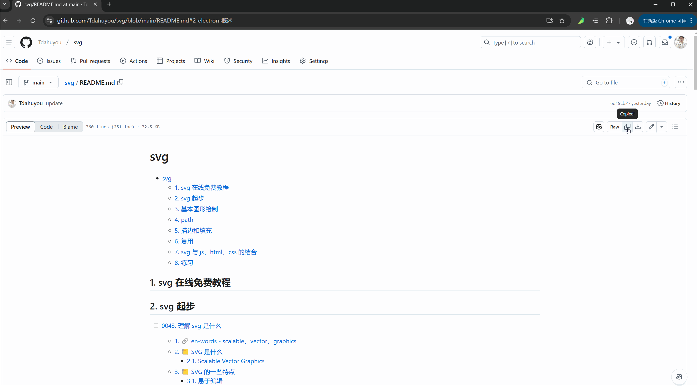

# [0026. m2mm](https://github.com/Tdahuyou/TNotes.introduction/tree/main/notes/0026.%20m2mm)

<!-- region:toc -->

- [1. 🧑🏻‍💻 m2mm](#1--m2mm)
- [2. 🔗 m2mm - github 仓库](#2--m2mm---github-仓库)
- [3. 🔗 网页版 - 在线使用](#3--网页版---在线使用)
- [4. 🔗 chrome 插件版](#4--chrome-插件版)
- [5. 💻 基本使用流程](#5--基本使用流程)
- [6. 📦 build](#6--build)
- [7. 🤔 m2mm 都有哪些应用场景？](#7--m2mm-都有哪些应用场景)
- [8. ⌛️ 自动识别文章](#8-️-自动识别文章)

<!-- endregion:toc -->

## 1. 🧑🏻‍💻 m2mm

- m2mm（markdown to markmap）是一款将无序列表形式的 markdown 内容转为 markmap 思维导图格式的工具。
- 转换结果是只读的，主要用于 **临时预览**。
- 编写 m2mm 的初衷是为了让自己的笔记大纲能够以思维导图的形式来呈现，以便笔记大纲的预览。
  - 结合 m2mm - 以思维导图的形式来呈现笔记大纲，这也是写这个小工具的初衷。
  - 

## 2. 🔗 m2mm - github 仓库

- https://github.com/Tdahuyou/m2mm

## 3. 🔗 网页版 - 在线使用

- https://tdahuyou.github.io/m2mm/
- 可在电脑、平板、手机上访问。

## 4. 🔗 chrome 插件版

- https://chromewebstore.google.com/detail/m2mm/efagcmmcgdofnhlpajgdpfdmicmkjkda?authuser=0&hl=zh-CN
- sidebar 默认位置是从右边弹出，可以通过 chrome 浏览器设置修改 sidebar 的位置为左侧。
  - 

## 5. 💻 基本使用流程

- 在 TNotes 上复制笔记大纲，然后丢到 m2mm 中。
  - 
- 也可以在 github 中直接复制文件原始内容。
  - 

## 6. 📦 build

- clone 仓库：

```bash
git clone https://github.com/Tdahuyou/m2mm
```

- 可自行根据需求做扩展，clone 代码后直接 build，然后手动加载到 chrome 中调试。

```bash
npm run build
```

- 

## 7. 🤔 m2mm 都有哪些应用场景？

- 只要你的内容是以 markdown 无序列表来编写的，都可以丢到 m2mm 中转换成思维导图的形式。
- 比如你有如下格式的笔记，你可以一键复制，然后丢到 m2mm 中。

```md
- 笔记标题
  - 目录 1
    - 内容 1
    - 内容 2
      - 内容 2.1
      - 内容 2.2
    - 内容 3
  - 目录 2
    - 目录 2.1
```

- 

---

- 或者在阅读某篇文章时，让 AI 提炼文章内容，并要求 AI 以指定格式返回，比如可以将下面这段内容丢给 chat gpt 4。

```md
https://github.com/Tdahuyou/javascript/blob/main/0001.%20var%20%E5%85%B3%E9%94%AE%E5%AD%97%E5%92%8C%E5%8F%98%E9%87%8F/README.md 请解读这篇文章，并且返回的内容格式要求是 markdown 无序列表的形式，比如：

- 标题
  - 目录 1
    - 内容 1
    - 内容 2
      - 内容 2.1
      - 内容 2.2
    - 内容 3
  - 目录 2
    - 目录 2.1
```

- 然后将 gpt4 回复的内容粘贴到 m2mm 中：
  - 
- 同样的内容丢给通义千问，得到的回复如下：

```md
根据提供的链接，文章内容聚焦于 JavaScript 编程语言中的`var`关键字和变量。以下是该文档的结构化解读，按照您的要求以 markdown 无序列表的形式呈现：

- JavaScript 中的 `var` 关键字和变量
  - `var` 声明变量的特点
    - 函数作用域而非块级作用域
      - 使用`var`声明的变量在函数内部是局部的，但在块（如 if 语句或 for 循环）中声明时不会创建一个新的作用域
    - 变量提升 (Hoisting)
      - `var`声明的变量会在其作用域内被移动到顶部，但初始化不会
  - `var` 的潜在问题
    - 重复声明
      - 允许在同一作用域内多次声明同一个变量而不会报错
    - 作用域链导致意外行为
      - 在嵌套函数中访问外部变量可能不是预期的结果
  - 最佳实践建议
    - 尽量使用`let`和`const`
      - ES6 引入了`let`和`const`，它们提供了更直观的作用域规则（块级作用域）
    - 避免使用`var`
      - 为了代码的一致性和可预测性，推荐避免使用`var`
  - 总结
    - 理解`var`的行为对于维护旧代码或者与遗留系统交互非常重要
    - 对于新项目，应该优先考虑使用`let`和`const`

请注意，上述信息是基于您提供的链接的内容摘要，实际文档可能会有更多细节和例子。如果您需要更具体的信息或者有其他问题，请随时告知。
```

- 将上述内容复制到 m2mm 中，得到的结果如下：
  - 
- 具体选择哪个 AI 模型，可以多体验一下，选择一个合适的即可。
- 可以保存一下提问模板，后续每次在提问的时候，只需要更新咨询的文章连接即可。
- 也可以多问几篇文章，然后利用类似文本编辑器（比如 vscode）对 AI 的回复格式做一些微调，合并在一起，然后一起丢到 m2mm 中，一次阅读多篇文档。

## 8. ⌛️ 自动识别文章

- 基本流程：
  - 第一步：自动将页面 html 转为 markdown；
  - 第二步：再生成 markmap；
- [turndown](https://github.com/mixmark-io/turndown#readme) - A library that converts HTML to Markdown
- 实测下来效果不太好，就没深究了，让 AI 来做第一步感觉效果反而好点儿。很多 AI 工具都具备解读文章，并将其转为 markmap 的功能，大致的流程应该也是上述这两步。手动将内容复制到 m2mm 中，从流程上来说多了一步，好处是能够在丢到 m2mm 之前，对内容做一些二次编辑，生成自己更想要的结果。
