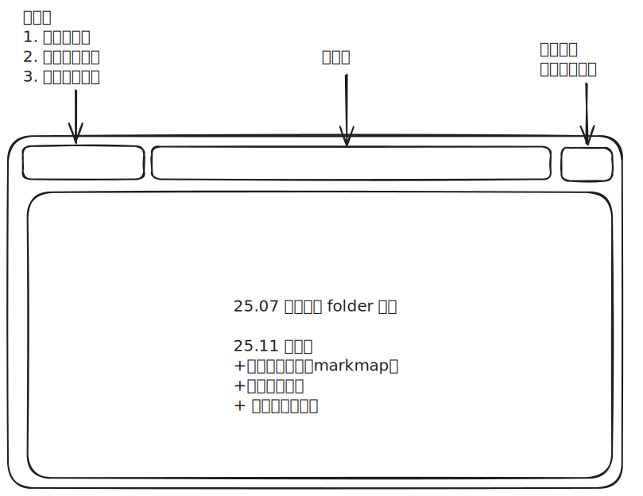
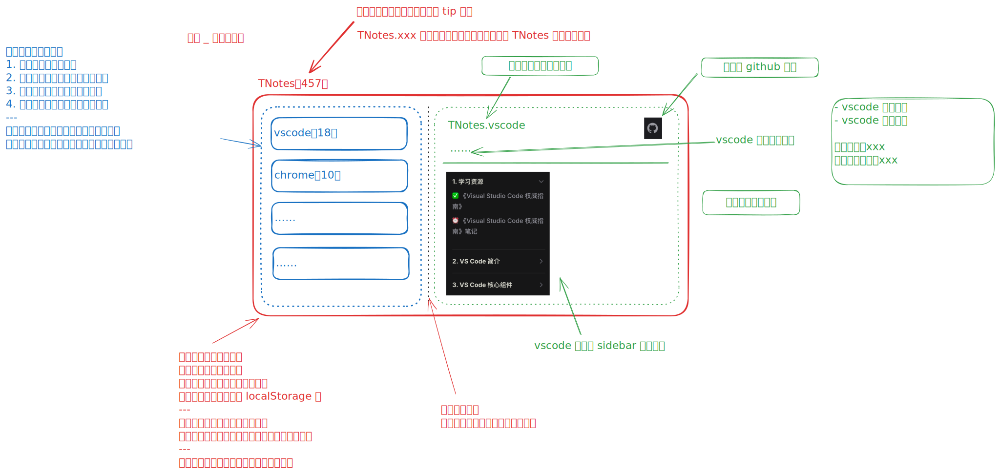

# [0028. TNotes 根知识库](https://github.com/tnotesjs/TNotes.introduction/tree/main/notes/0028.%20TNotes%20%E6%A0%B9%E7%9F%A5%E8%AF%86%E5%BA%93)

<!-- region:toc -->

- [1. 🎯 本节内容](#1--本节内容)
- [2. 🫧 评价](#2--评价)
- [3. 🤔 TNotes 首页是？](#3--tnotes-首页是)
- [4. 🤔 首页的历史版本都有哪些？](#4--首页的历史版本都有哪些)
  - [4.1. v26.03](#41-v2603)
  - [4.2. v25.01](#42-v2501)
    - [原型草稿](#原型草稿)
    - [最终效果](#最终效果)
  - [4.3. v25.07](#43-v2507)
    - [原型草稿](#原型草稿)
    - [最终效果](#最终效果)
  - [4.4. 初版](#44-初版)
- [5. 🔗 引用](#5--引用)

<!-- endregion:toc -->

## 1. 🎯 本节内容

- TNotes 首页结构简介

## 2. 🫧 评价

TNotes 首页相当于是 TNotes.xxx 知识库的根，主要作用是连接所有知识库，提供快速导航功能。

## 3. 🤔 TNotes 首页是？

TNtoes 首页相当于是 TNotes.xxx 子知识库的根，核心功能：为所有知识库的笔记提供导航，以便能够更便捷地找到对应的笔记。

- [github 仓库][1]
- [GitHub pages 在线访问链接][2]

## 4. 🤔 首页的历史版本都有哪些？

后续的改造计划都汇总到这一部分来记录，类似一个 changelog，记录首页结构的变化历史。

### 4.1. v26.03

- 简化首页样式风格
- 添加近一年笔记的完成数量变化趋势图

### 4.2. v25.01

#### 原型草稿

#### 最终效果

::: swiper

:::

### 4.3. v25.07

#### 原型草稿

#### 最终效果

### 4.4. 初版

直接基于 vitepress 内置组件来实现。

## 5. 🔗 引用

- [tnotesjs - github][1]
- [tnotesjs - gitHub pages][2]

[1]: https://github.com/tnotesjs/TNotes
[2]: https://tnotesjs.github.io/TNotes/
