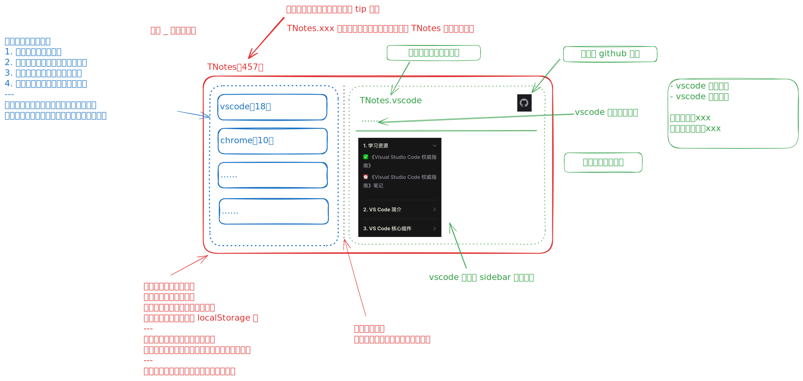

# [0028. TNotes 首页](https://github.com/tnotesjs/TNotes.introduction/tree/main/notes/0028.%20TNotes%20%E9%A6%96%E9%A1%B5)

<!-- region:toc -->

- [1. 🫧 评价](#1--评价)
- [2. 🤔 TNotes 首页是？](#2--tnotes-首页是)
- [3. 🧠 首页改造计划](#3--首页改造计划)
  - [3.1. 🗓 25-07](#31--25-07)
  - [3.2. 🗓 初版](#32--初版)
- [4. 🔗 引用](#4--引用)

<!-- endregion:toc -->

## 1. 🫧 评价

- 介绍 TNtoes 首页的基本结构。

## 2. 🤔 TNotes 首页是？

- [github][1]
- [在线访问][2]
- 首页核心功能：为所有知识库的笔记提供导航，以便能够更便捷地找到对应的笔记。

## 3. 🧠 首页改造计划

### 3.1. 🗓 25-07

- 原型草稿：
- 
- 最终效果：
- 

### 3.2. 🗓 初版

- 直接基于 vitepress 内置组件来实现。
- 

## 4. 🔗 引用

- TNtoes
  - [github][1]
  - [GitHub pages][1]

[1]: https://github.com/tnotesjs/TNotes
[2]: https://tnotesjs.github.io/TNotes/
